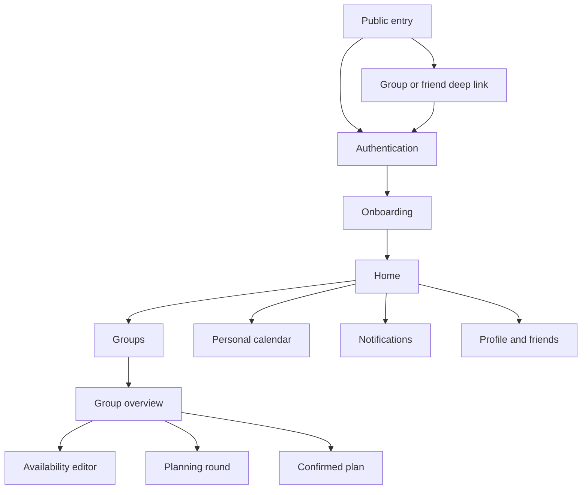
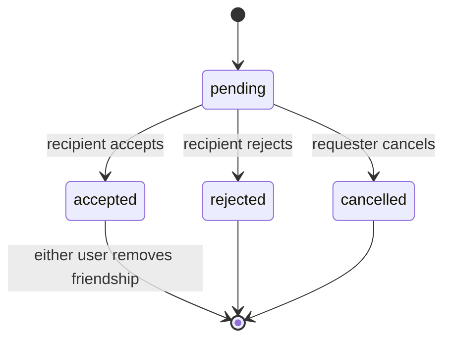
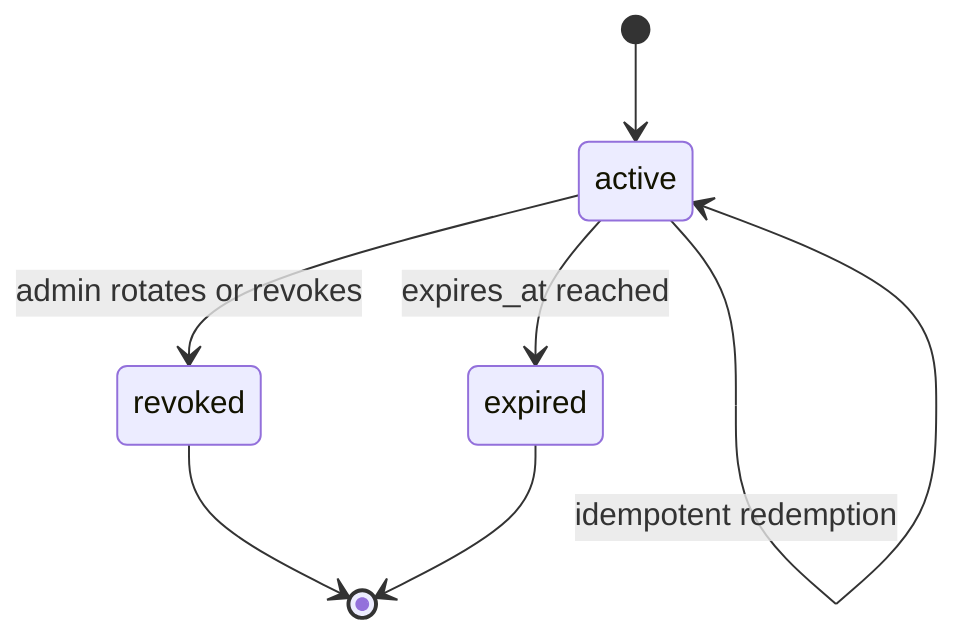
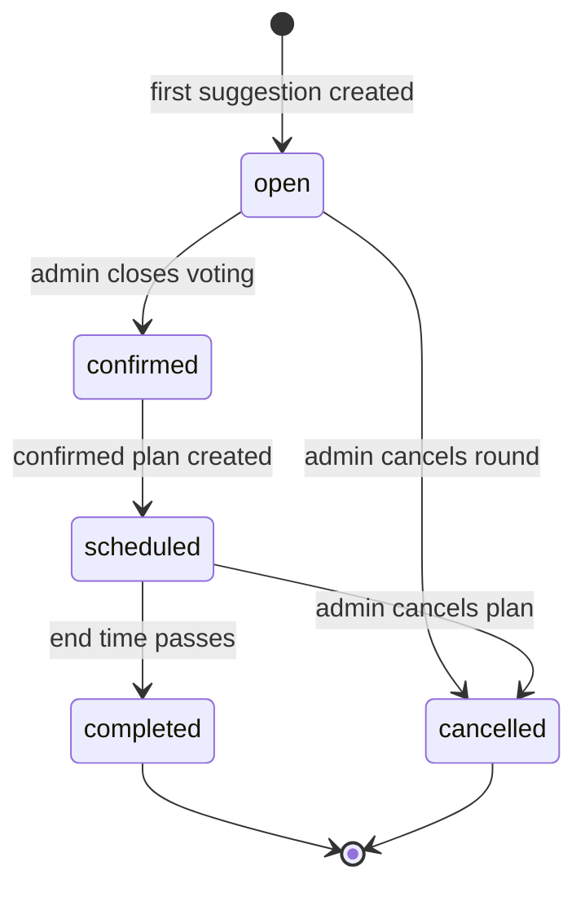
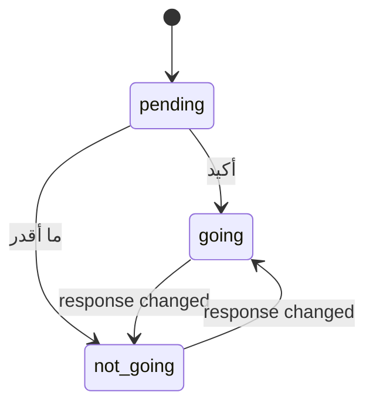
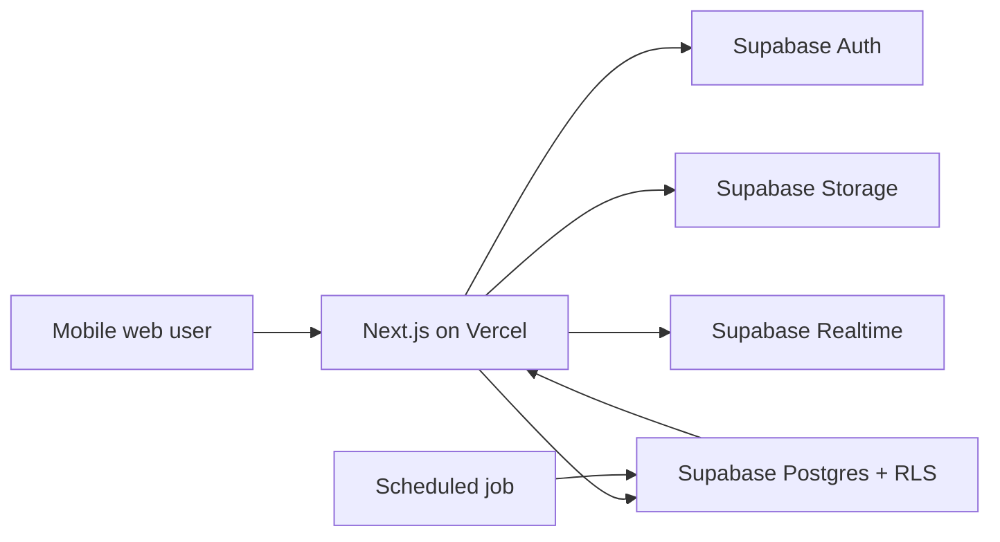
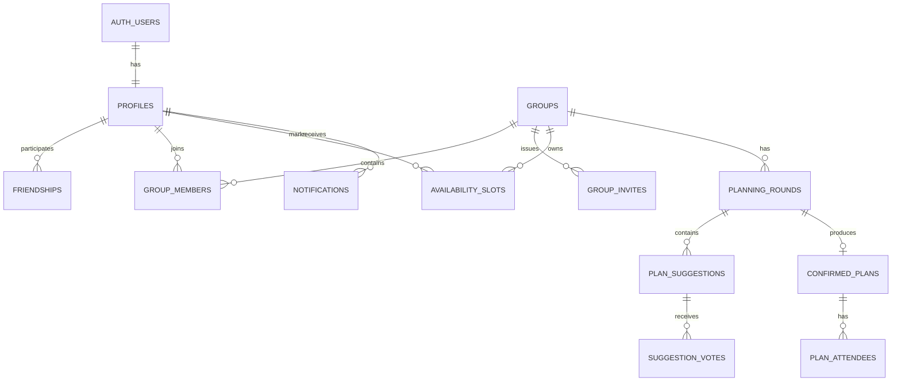

# فاضي؟ — Product Requirements Document

**Product:** فاضي؟  
**Document type:** MVP Product Requirements Document  
**Version:** 1.0  
**Status:** Build-ready  
**Primary market:** Saudi Arabia  
**Primary language:** Arabic (Saudi dialect)  
**Implementation stack:** Next.js, TypeScript, Tailwind CSS, Supabase, Vercel  
**MVP timezone:** `Asia/Riyadh`  

> **Product statement:** فاضي؟ يخليك تعرف متى أصحابك فاضين وتتفقون على وش تسوون.

---

## Table of Contents

1. [Executive Summary](#1-executive-summary)
2. [Product Strategy](#2-product-strategy)
3. [Target Market, Personas, and Jobs](#3-target-market-personas-and-jobs)
4. [Core Journey and Onboarding](#4-core-journey-and-onboarding)
5. [Experience Architecture](#5-experience-architecture)
6. [Functional Requirements](#6-functional-requirements)
7. [Business Rules and State Models](#7-business-rules-and-state-models)
8. [UX States, Localization, and Accessibility](#8-ux-states-localization-and-accessibility)
9. [Technical Design](#9-technical-design)
10. [Analytics and Success Metrics](#10-analytics-and-success-metrics)
11. [MVP Scope and Roadmap](#11-mvp-scope-and-roadmap)
12. [Delivery Plan](#12-delivery-plan)
13. [Launch Criteria and Definition of Done](#13-launch-criteria-and-definition-of-done)
14. [Risks, Assumptions, and Deferred Questions](#14-risks-assumptions-and-deferred-questions)
15. [Appendices](#15-appendices)

---

# 1. Executive Summary

فاضي؟ is a Saudi-first social planning website for persistent friend and family groups. It replaces the repeated WhatsApp coordination loop—“فاضي الخميس؟”, “أنا بعد ٩”, “وش نسوي؟”—with one shared flow:

**Friends → Groups → Availability → Overlap → Suggest → Vote → Confirm → Repeat**

The product is not a one-time scheduling poll. Each group has an ongoing calendar where members mark availability for the next four weeks. The system detects useful overlaps, lets members suggest activities for a shared time, uses approval voting to identify acceptable options, and turns the selected option into a confirmed group plan with explicit attendance responses.

The MVP is an Arabic-first, RTL, mobile-first website optimized for links opened inside WhatsApp. It uses accounts, private groups, group-scoped availability, in-app notifications, and shareable invite and plan links. It deliberately excludes discovery engines, booking integrations, payments, native apps, chat, AI, and calendar integrations.

## 1.1 MVP outcome

The MVP succeeds when a Saudi group can complete the entire planning loop without returning to WhatsApp for availability collection or decision-making, apart from using WhatsApp to invite members or share the final plan.

## 1.2 North Star

**North Star Metric:** Confirmed group plans per week.

This measures successful completion of the product’s core loop rather than passive browsing, account creation, or availability entry alone.

## 1.3 Primary hypothesis

Saudi friend groups will repeatedly use a shared availability calendar when it reduces coordination effort compared with WhatsApp messages.

## 1.4 Secondary hypothesis

Once useful availability overlap is visible, lightweight activity suggestions and approval voting will increase the percentage of groups that turn free time into confirmed plans.

---

# 2. Product Strategy

## 2.1 Vision

Become the default place Saudi groups use to answer two recurring questions:

1. **متى كلنا فاضين؟**
2. **وش الخطة؟**

## 2.2 Problem statement

Group planning on WhatsApp is conversational but inefficient. Availability is fragmented across many messages, late-night windows cross calendar dates, members reply at different times, proposals become mixed with availability replies, and there is no durable record of the decision. Existing scheduling tools often feel like workplace software or one-off polls and do not complete the social planning loop.

## 2.3 Core value proposition

For Saudi friend groups who repeatedly coordinate social plans, فاضي؟ provides a private, persistent group calendar that identifies when members are free and helps them agree on what to do. Unlike one-time polls or business calendars, it combines availability, overlap detection, social suggestions, voting, and confirmation in a casual Saudi-first experience.

## 2.4 Product goals

- Make group availability understandable in under five seconds on a mobile screen.
- Let a member add or edit a week of availability in under one minute.
- Preserve a WhatsApp invite’s intent through signup and onboarding.
- Turn a useful overlap into an open planning round in no more than three taps.
- Make voting understandable without rules or instructions.
- Keep group data private and inaccessible to non-members.
- Encourage the same group to plan again within 30 days.

## 2.5 Non-goals for MVP

- Discovering venues, movies, restaurants, or events.
- Booking or paying for activities.
- Replacing group chat.
- Managing work meetings or professional appointments.
- Publishing group activity to a social feed.
- Becoming a general-purpose personal calendar.
- Supporting multiple languages, calendars, or native apps.

## 2.6 Product principles

1. **The group is the product.** Optimize group activation and repeat planning over individual profile engagement.
2. **Show the answer first.** Lead with the next useful overlap, upcoming plan, or action requiring the user.
3. **Casual, not corporate.** Prefer clear cards, names, avatars, and Saudi Arabic over grids, forms, and formal scheduling terms.
4. **Fast by default, precise when needed.** Offer quick evening blocks with a custom-time escape hatch.
5. **Private by construction.** Availability, votes, members, and plans are group-only.
6. **Explicit decisions beat assumptions.** Voting and attendance are explicit; availability never silently confirms attendance.
7. **WhatsApp is an entry point, not the database.** Sharing should be excellent, while the source of truth remains فاضي؟.
8. **Build the complete loop before adding breadth.** Every MVP feature must support activation, planning, confirmation, or repeat use.

## 2.7 Competitive positioning

Howbout and Partiful are useful conceptual references for easy social planning, but فاضي؟ differentiates through persistent private groups, a shared availability calendar, automatic overlap ranking, Saudi late-night time patterns, Arabic-first RTL design, activity suggestions, and group voting in one continuous loop.

---

# 3. Target Market, Personas, and Jobs

## 3.1 Target market

- **Geography:** Saudi Arabia
- **Initial age range:** 18–35
- **Primary contexts:** university friends, young professionals, family groups, gaming groups, football groups, padel groups, travel groups, and coworkers planning outside work
- **Primary device:** mobile browser, frequently opened inside a WhatsApp in-app browser

## 3.2 Personas

| Persona | Context | Main need | Friction today | MVP success signal |
|---|---|---|---|---|
| The organizer | Usually starts the WhatsApp conversation and follows up | Find a viable time and close the decision | Repeats questions and reconciles replies manually | Creates a group, sees an overlap, and confirms a plan |
| The responder | Wants to join but rarely organizes | Respond quickly without reading a long chat | Misses messages or answers incompletely | Marks availability and votes in under a minute |
| The activity advocate | Suggests cinema, padel, coffee, or food | Put an idea in front of the group and measure support | Suggestions get buried or mixed together | Adds a suggestion and receives votes |
| The late joiner | Opens a link after the group already started planning | Join without losing the shared context | Must ask what was decided | Joins securely and sees current availability, voting, and plans |
| The family coordinator | Coordinates different schedules and mixed technical comfort | Use simple, recognizable actions | Formal calendar products feel too complex | Completes the flow without instructions |

## 3.3 Jobs-to-be-Done

### Functional jobs

- When I want to plan with a recurring group, help me see when enough people are free so I do not collect replies manually.
- When a useful time appears, help us compare acceptable activities and reach a decision.
- When a plan is confirmed, help everyone see the details and state whether they are coming.
- When I receive a WhatsApp invite, preserve the invitation while I create an account.

### Emotional jobs

- Help planning feel lightweight and social rather than administrative.
- Reduce the awkwardness of repeatedly chasing people for answers.
- Give the group confidence that the chosen time and plan are understood.

### Social jobs

- Let organizers move the group forward without appearing controlling.
- Let members express several acceptable options rather than forcing a single favorite.
- Make participation visible without exposing group activity publicly.

## 3.4 Activation definitions

- **User activation:** Within seven days of signup, the user completes a profile, creates or joins a group, and saves at least one availability interval. Adding a friend is tracked as a separate activation step because invite-led users may productively join without first becoming friends.
- **Group activation:** Within seven days of creation, at least three members have joined and at least three distinct members have saved availability.

---

# 4. Core Journey and Onboarding

## 4.1 Canonical journey

Yousef creates a private group called **الشباب** and shares the invite in WhatsApp. Six friends join and mark availability during the week. On Wednesday, فاضي؟ detects that all six are free on Thursday from 10:00 PM to midnight and shows:

> 🎉 كلكم فاضين الخميس من ١٠ م إلى ١٢ ص

Ahmed opens a planning round and suggests **🎾 بادل**. Faisal adds **🎬 سينما**, and Yousef adds **☕ قهوة**. Members tap every option they would accept. An admin closes voting, selects the highest-voted option, and confirms the details. Each member answers **أكيد** or **ما أقدر**. The confirmed event appears in the group and personal calendars, and attendees receive one in-app reminder 24 hours before it begins.

## 4.2 Direct signup journey

1. User selects **سو حساب**.
2. User enters email and password.
3. The system creates the account and requests email confirmation.
4. After confirmation, the user returns to the intended application route.
5. User completes display name and unique username; avatar is optional.
6. User may search for friends or share a friend invite. This step is skippable.
7. User creates a group or joins one. This step is skippable only when no invite intent exists.
8. If the user belongs to a group, onboarding teaches availability using real group data.
9. User lands on Home with the most relevant next action.

## 4.3 Group invite journey

1. Recipient opens `/join/[token]` from WhatsApp.
2. Before authorization, the page shows only generic copy: **جاك رابط قروب في فاضي؟**. It does not reveal the group name, members, plan, or inviter.
3. The token is stored as a short-lived, same-site pending intent; it is never placed in an open redirect parameter.
4. If signed out, the recipient signs up or logs in and completes the required profile step.
5. The user selects **انضم للقروب**.
6. The server atomically validates the token, capacity, existing membership, and invite state, then adds the user.
7. Duplicate redemption is idempotent and routes the existing member to the group.
8. Invalid, expired, or revoked links show a safe recovery state with **اطلب رابط جديد**.

## 4.4 Friend invite journey

1. Recipient opens `/invite/[username]`.
2. If signed out, the route is preserved through authentication.
3. After authentication, the user sees the intended username and selects **أضف صديق**.
4. The system creates or surfaces the existing pending/accepted relationship without duplicating it.

## 4.5 Returning-user loop

Home prioritizes:

1. Plans starting soon.
2. Voting or RSVP actions requiring the user.
3. New full or near overlaps.
4. Groups that still need the user’s availability.
5. The user’s groups.

---

# 5. Experience Architecture

## 5.1 Information architecture



## 5.2 Mobile navigation

The fixed bottom navigation contains four destinations:

| Tab | Arabic label | Purpose |
|---|---|---|
| Home | الرئيسية | Upcoming plans, required actions, overlaps, and recent group activity |
| Groups | القروبات | Group list, creation, and group detail |
| Calendar | التقويم | The user’s availability and confirmed plans across groups |
| Profile | حسابي | Profile, friends, settings, and logout |

Notifications are opened from a header bell. An unread badge appears only when unread items exist. Keeping notifications outside the bottom navigation preserves space for the four recurring destinations.

## 5.3 Recommended routes

| Route | Access | Purpose |
|---|---|---|
| `/` | Public | Product landing page and authentication entry |
| `/auth/sign-up` | Public | Email/password registration |
| `/auth/sign-in` | Public | Login |
| `/auth/forgot-password` | Public | Password reset request |
| `/auth/reset-password` | Auth callback | Set a new password |
| `/auth/callback` | Auth callback | Confirm email and restore pending intent |
| `/join/[token]` | Public shell | Preserve and redeem a group invite without leaking group data |
| `/invite/[username]` | Public shell | Preserve a friend-invite intent |
| `/onboarding` | Authenticated | Required profile plus skippable friend/group education steps |
| `/home` | Authenticated | Attention-first dashboard |
| `/groups` | Authenticated | Group list |
| `/groups/new` | Authenticated | Create a group |
| `/groups/[groupId]` | Member | Group overview, overlaps, open rounds, plans, and members |
| `/groups/[groupId]/availability` | Member | Mobile availability editor |
| `/groups/[groupId]/plans/[roundId]` | Member | Suggestions and approval voting |
| `/groups/[groupId]/events/[planId]` | Member | Confirmed-plan details and attendance |
| `/calendar` | Authenticated | Personal aggregated calendar |
| `/notifications` | Authenticated | In-app notification inbox |
| `/friends` | Authenticated | Friends, incoming requests, and search |
| `/profile` | Authenticated | Profile overview |
| `/settings` | Authenticated | Account, Arabic language status, and logout |

Unknown IDs, deleted entities, and unauthorized resources return the same member-safe not-found experience to avoid confirming private resource existence.

## 5.4 Home structure

1. **خطط جاية** — confirmed plans ordered by start time.
2. **يحتاج ردك** — RSVP, friend request, missing availability, or an open planning round in which the user has not selected any active suggestion. Once the user casts at least one active vote, that round no longer appears as a pending-vote action.
3. **القروب فاضي 👀** — the most relevant unplanned full/near overlap per group.
4. **قروباتي** — compact group list with last relevant activity.

Sections with no content are omitted rather than shown as empty dashboard widgets.

## 5.5 Group page structure

1. Header: group image, name, member avatars, and share invite action.
2. Best upcoming overlap with **وش الخطة؟** CTA.
3. Seven-day availability list with a switch to later weeks.
4. Open planning rounds requiring votes.
5. Upcoming confirmed plans.
6. Members and group settings, collapsed behind a secondary action.

The page uses a vertical mobile feed, not a dense month-grid calendar.

## 5.6 Personal calendar interaction

- Shows only the signed-in user’s own availability and confirmed plans.
- Availability remains tagged by group; one group cannot see entries made for another.
- Same-time entries from multiple groups are stacked or summarized as **متوفر في قروبين**.
- Confirmed plans use stronger event cards than availability.
- Conflicts between confirmed plans are highlighted to the user but never auto-resolved.

---

# 6. Functional Requirements

Priority labels: **P0** is required for MVP launch; **P1** may launch only if all P0 work is complete and quality is not reduced.

## 6.1 Authentication and account

| ID | Priority | Requirement |
|---|---|---|
| AUTH-001 | P0 | Users shall register with email and password through Supabase Auth. |
| AUTH-002 | P0 | Users shall confirm their email before accessing private group data. |
| AUTH-003 | P0 | Users shall log in, log out, request a password reset, and set a new password. |
| AUTH-004 | P0 | The app shall preserve valid group/friend invite intent through signup, confirmation, login, and required onboarding. |
| AUTH-005 | P0 | Authenticated users without a completed profile shall be redirected to onboarding before other private routes. |
| AUTH-006 | P0 | Authentication errors shall not reveal whether an email address is registered. |
| AUTH-007 | P0 | Sessions shall work in Safari, Chrome, and common WhatsApp in-app browser contexts where cookies are permitted. |

### Acceptance criteria — authentication

- **Given** a new user opened a valid group invite, **when** they register, confirm email, and complete their profile, **then** the app restores the invite and lets them join without reopening the WhatsApp link.
- **Given** an unconfirmed account, **when** it requests a private route, **then** no group data is returned and the user is directed to confirmation guidance.
- **Given** an unknown or known email, **when** password reset is requested, **then** the same neutral confirmation is shown.

## 6.2 Profile and onboarding

| ID | Priority | Requirement |
|---|---|---|
| PRO-001 | P0 | Onboarding shall collect a display name of 1–50 characters and a unique username of 3–20 characters. |
| PRO-002 | P0 | Usernames shall be lowercase, case-insensitively unique, and limited to Latin letters, numbers, and underscores. |
| PRO-003 | P0 | Users shall optionally upload a JPEG, PNG, or WebP avatar up to 5 MB. |
| PRO-004 | P0 | Users shall edit their display name, username, and avatar. |
| PRO-005 | P0 | Onboarding shall use the steps Welcome → Profile → Friends → Group → Availability, while allowing Friends and Group to be skipped when no pending invite requires them. |
| PRO-006 | P0 | A pending group invite shall take precedence over the create-group onboarding step. |
| PRO-007 | P0 | Availability education shall operate on a real joined/created group and shall be skipped when the user has no group. |
| PRO-008 | P0 | Profile shall show name, username, avatar, shortcuts to friends and groups, Arabic language status, settings, and logout. |

### Acceptance criteria — profile and onboarding

- **Given** a username differing only by letter case from an existing username, **when** submitted, **then** it is rejected with **اسم المستخدم مستخدم**.
- **Given** a valid pending group invite, **when** the user reaches the group onboarding step, **then** the UI offers the preserved invite before group creation.
- **Given** an optional onboarding step, **when** the user skips it, **then** onboarding can still complete and Home provides a relevant next action.

## 6.3 Friends

| ID | Priority | Requirement |
|---|---|---|
| FRN-001 | P0 | Authenticated users shall search for other users by exact or prefix username. |
| FRN-002 | P0 | Users shall send one pending friend request per user pair. |
| FRN-003 | P0 | Recipients shall accept or reject incoming requests; requesters shall cancel outgoing requests. |
| FRN-004 | P0 | Accepted friendship shall be mutual. |
| FRN-005 | P0 | Either user shall remove an accepted friendship. |
| FRN-006 | P0 | Removing a friend shall not remove either user from shared groups or alter prior group activity. |
| FRN-007 | P0 | Users shall share `/invite/[username]` through native share or WhatsApp. |
| FRN-008 | P0 | The app shall not allow requests to self, duplicates, or new requests for an accepted pair. |

### Acceptance criteria — friends

- **Given** a pending request already exists in either direction, **when** either user tries to send another, **then** no duplicate row or notification is created.
- **Given** two friends share a group, **when** one removes the friendship, **then** both remain group members and retain group-only access.
- **Given** a rejected request, **when** a new request is attempted within 24 hours, **then** it is rate-limited to reduce harassment.

## 6.4 Groups and membership

| ID | Priority | Requirement |
|---|---|---|
| GRP-001 | P0 | Authenticated users shall create persistent groups with a 1–40 character name and optional image. |
| GRP-002 | P0 | Every group shall have exactly one owner, zero or more admins, and up to 29 additional members. |
| GRP-003 | P0 | Group size shall not exceed 30 active members. |
| GRP-004 | P0 | Group owners/admins shall edit the group name/image, invite users, remove members, close voting, confirm plans, and cancel plans. |
| GRP-005 | P0 | Only the owner shall transfer ownership, promote/demote admins, or delete the group. |
| GRP-006 | P0 | Members shall mark availability, create planning rounds, suggest plans, vote, RSVP, and leave. |
| GRP-007 | P0 | An owner shall transfer ownership before leaving a group that has other members. |
| GRP-008 | P0 | Removing or leaving a group shall revoke future access immediately while preserving historical attribution inside the group. |
| GRP-009 | P0 | Deleting a group shall make it inaccessible, revoke invites, cancel scheduled plans, and retain recoverable database records for 30 days before permanent deletion. |
| GRP-010 | P0 | Each active member shall receive a unique token from a 30-color accessible palette; color shall never be the sole identity cue. |

### Acceptance criteria — groups

- **Given** a 30-member group, **when** another valid invite is redeemed, **then** joining fails with **القروب مكتمل** and no partial membership is created.
- **Given** an owner with other group members, **when** they attempt to leave without transferring ownership, **then** the action is blocked and the transfer flow is shown.
- **Given** a removed member, **when** they use a cached route or direct Supabase request, **then** RLS returns no private group data.
- **Given** an owner deletes a group, **when** members open old links, **then** they see a neutral unavailable state and scheduled-plan cancellation notifications.

## 6.5 Group invites

| ID | Priority | Requirement |
|---|---|---|
| INV-001 | P0 | Owners/admins shall create a cryptographically random group invite link whose server-side token is stored only as a hash. |
| INV-002 | P0 | Group invite links shall expire 30 days after creation unless revoked earlier. |
| INV-003 | P0 | Owners/admins shall rotate an invite, immediately revoking the previous active link. |
| INV-004 | P0 | Opening an invite before authorization shall not expose group name, members, availability, votes, or plans. |
| INV-005 | P0 | Invite redemption shall atomically validate authentication, expiry, revocation, group state, capacity, and existing membership. |
| INV-006 | P0 | Reopening a redeemed invite as an existing member shall route to the group without creating a duplicate membership. |
| INV-007 | P0 | Joining through an invite shall not require friendship with any member. |

### Acceptance criteria — invites

- **Given** a revoked or expired token, **when** it is redeemed, **then** membership is not created and the UI requests a new link without exposing group details.
- **Given** two concurrent redemptions for the final group seat, **when** both execute, **then** one succeeds and the other receives `GROUP_FULL`.
- **Given** a non-member knows a group UUID, **when** they query it directly, **then** the response does not reveal whether the group exists.

## 6.6 Availability entry and calendar

| ID | Priority | Requirement |
|---|---|---|
| AVL-001 | P0 | Availability shall be scoped to one group and visible only to active members of that group. |
| AVL-002 | P0 | Users shall add, edit, and remove only their own availability. |
| AVL-003 | P0 | The editor shall offer 4–6 PM, 6–8 PM, 8–10 PM, 10 PM–12 AM, and 12–2 AM quick blocks plus custom start/end times. On a selected day, 12–2 AM means the two hours immediately following that evening and therefore falls on the next calendar date. |
| AVL-004 | P0 | Users shall mark availability from today through 28 calendar days ahead in the group timezone. |
| AVL-005 | P0 | The interface shall support intervals crossing midnight, including Thursday 10 PM to Friday 2 AM, as one logical entry. |
| AVL-006 | P0 | Saved intervals shall use exact UTC timestamps while rendering in `Asia/Riyadh`. |
| AVL-007 | P0 | Overlapping or adjacent intervals belonging to the same member/group shall be merged on save. |
| AVL-008 | P0 | Past intervals shall be read-only and omitted from overlap suggestions. |
| AVL-009 | P0 | The group calendar shall show member avatar/initial, name, assigned color, and availability count; color alone is insufficient. |
| AVL-010 | P0 | The mobile default shall show seven days at a time with navigation across the 28-day horizon. |
| AVL-011 | P0 | The personal calendar shall aggregate only the current user’s group-scoped availability and confirmed plans. |
| AVL-012 | P0 | Availability changes after voting or confirmation shall not silently change votes, attendance, or confirmed plan details. |

### Acceptance criteria — availability

- **Given** Thursday 10 PM to Friday 2 AM, **when** saved, **then** the server stores a valid continuous interval and both calendar dates render correctly.
- **Given** 8–10 PM and 10 PM–12 AM are selected, **when** saved, **then** one 8 PM–12 AM interval is persisted.
- **Given** the same user belongs to two groups, **when** availability is entered in one group, **then** the other group cannot read it.
- **Given** a network failure during save, **when** optimistic UI was shown, **then** the change rolls back and **ما حفظنا وقتك، جرّب مرة ثانية** appears with Retry.

## 6.7 Overlap detection

| ID | Priority | Requirement |
|---|---|---|
| OVL-001 | P0 | The system shall derive overlaps dynamically from active members and current availability; no `availability_matches` records shall be stored. |
| OVL-002 | P0 | The calculation shall count each member at most once within any segment, even when their source intervals overlap. |
| OVL-003 | P0 | Candidate overlaps shall be at least 60 continuous minutes. |
| OVL-004 | P0 | Results shall rank by 100% availability, available-member count, longer duration, then earlier start. |
| OVL-005 | P0 | Each group shall display at most the three highest-ranked future overlaps. |
| OVL-006 | P0 | A near-match requires at least 75% of active members and at least three available members. |
| OVL-007 | P0 | In a two-person group, only two-of-two availability shall be promoted as a match. |
| OVL-008 | P0 | A full match shall display **🎉 كلكم فاضين**; a partial match shall display the exact count, such as **5 من 6 فاضين**. |
| OVL-009 | P0 | Results shall update within one second after a successful availability mutation for groups up to 30 members. |
| OVL-010 | P0 | A meaningful match notification shall be created only when a slot first becomes full or first crosses the near-match threshold. |

### Acceptance criteria — overlap detection

- **Given** six active members and five available for 90 minutes, **when** overlap is calculated, **then** the slot qualifies as a near-match and shows `5 من 6`.
- **Given** a duplicate interval for one member, **when** overlap is calculated, **then** the member is counted once.
- **Given** equal availability counts, **when** two slots are ranked, **then** the longer slot ranks first; equal durations are ordered by earliest start.
- **Given** a slot falls below and then crosses the same near-match threshold repeatedly within 24 hours, **when** recalculated, **then** users receive no duplicate threshold notification during that window.

## 6.8 Planning rounds and suggestions

| ID | Priority | Requirement |
|---|---|---|
| PLN-001 | P0 | Any active group member shall open a planning round for a future window inside the 28-day horizon. |
| PLN-002 | P0 | A planning round may start from a detected overlap or a manually selected future window. |
| PLN-003 | P0 | Each round shall have one fixed window; suggestions may choose exact start/end times only within it. |
| PLN-004 | P0 | A round shall become open when its first valid suggestion is created. |
| PLN-005 | P0 | Any active member shall add an active suggestion while the round is open. |
| PLN-006 | P0 | Each suggestion shall include a category and title; description, location, and external link are optional. |
| PLN-007 | P0 | Categories shall be أكل, سينما, بادل, كورة, قهوة, قيمنق, استراحة, طلعة, تسوق, بولينق, or غيره. |
| PLN-008 | P0 | A suggestion’s creator shall withdraw it only while the round is open; withdrawal shall remove its votes from active tallies but preserve audit history. |
| PLN-009 | P0 | External links shall be validated as `https` URLs and displayed without server-side fetching or previews. |
| PLN-010 | P0 | Members shall see exact available-member count for the round window, but unavailable members shall not be identified outside the private group. |

### Acceptance criteria — planning and suggestions

- **Given** a manually selected window has no overlap, **when** a member starts a round, **then** the UI shows `0 من N فاضين` and requires confirmation before creating it.
- **Given** a suggestion time extends outside the round window, **when** submitted, **then** validation fails without creating a suggestion.
- **Given** a closed round, **when** a member submits or withdraws a suggestion, **then** the server returns `ROUND_CLOSED`.

## 6.9 Approval voting

| ID | Priority | Requirement |
|---|---|---|
| VOT-001 | P0 | Members shall vote for every active suggestion they would accept. |
| VOT-002 | P0 | One member shall have at most one active vote per suggestion. |
| VOT-003 | P0 | Members shall add or remove their votes until the round closes. |
| VOT-004 | P0 | Vote updates shall be idempotent and protected by a unique database constraint. |
| VOT-005 | P0 | All group members shall see current totals and which suggestions they personally selected. |
| VOT-006 | P0 | Only the owner/admin shall close voting and confirm a winner. |
| VOT-007 | P0 | The server shall identify the highest-voted active suggestion; if tied, the closing admin shall choose one of the tied leaders. |
| VOT-008 | P0 | An admin may not select a non-leading suggestion unless all active suggestions have zero votes, in which case any active suggestion is valid. |

### Acceptance criteria — voting

- **Given** a user accepts cinema and coffee, **when** both are selected, **then** two vote records exist and both counts increase once.
- **Given** repeated identical vote requests, **when** processed, **then** the final vote state is correct and no duplicate row exists.
- **Given** a three-way tie, **when** an admin closes voting, **then** only one tied leader may be selected.
- **Given** a member is removed before closure, **when** totals are calculated, **then** their votes no longer count toward the active tally.

## 6.10 Confirmation and attendance

| ID | Priority | Requirement |
|---|---|---|
| CNF-001 | P0 | Closing a round shall atomically validate the winner, create one confirmed plan, and set the round to `confirmed`. |
| CNF-002 | P0 | The confirmed plan shall snapshot category, title, description, exact time, location, and external link from the winning suggestion. |
| CNF-003 | P0 | Confirmation shall create a `pending` attendance record for every active member at that moment. |
| CNF-004 | P0 | Each listed member shall respond **أكيد** (`going`) or **ما أقدر** (`not_going`) and may change the response before the plan ends. |
| CNF-005 | P0 | Availability and voting shall never automatically set attendance. |
| CNF-006 | P0 | Confirmed plans shall appear on group and personal calendars immediately. |
| CNF-007 | P0 | Owners/admins shall cancel a scheduled plan with an optional reason; cancelled plans remain visible as cancelled. |
| CNF-008 | P0 | Plans become `completed` after their end time through a scheduled idempotent job. |
| CNF-009 | P0 | Members who join after confirmation may add their own pending attendance record and respond. |

### Acceptance criteria — confirmation and attendance

- **Given** two admins attempt to close the same round concurrently, **when** both transactions run, **then** exactly one confirmed plan is created.
- **Given** a member was available and voted for the winner, **when** the plan is confirmed, **then** attendance remains `pending` until explicitly answered.
- **Given** a plan is cancelled, **when** a member opens it, **then** the cancellation state and reason are visible and no upcoming reminder is generated.

## 6.11 Home, calendar, and notifications

| ID | Priority | Requirement |
|---|---|---|
| HOM-001 | P0 | Home shall order actionable/upcoming content according to Section 4.5 and omit empty sections. |
| HOM-002 | P0 | A group card shall show only the most relevant current action or result, not a dense activity feed. |
| CAL-001 | P0 | The personal calendar shall distinguish availability subtly and confirmed plans with stronger cards. |
| CAL-002 | P0 | Calendar entries shall show group identity and warn about confirmed-plan time conflicts. |
| NOT-001 | P0 | The app shall provide an in-app notification inbox and header unread badge. |
| NOT-002 | P0 | Notification types shall include friend request, overlap threshold, new suggestion, vote activity, plan confirmation, cancellation, RSVP request, and 24-hour reminder. |
| NOT-003 | P0 | Users shall mark one notification or all notifications as read. |
| NOT-004 | P0 | The actor shall not receive a notification for their own action. |
| NOT-005 | P0 | Notification generation shall use deterministic deduplication keys. |
| NOT-006 | P0 | New suggestions shall notify other members once; individual votes shall be aggregated into at most one unread vote-activity notification per user and round. |
| NOT-007 | P0 | A scheduled job shall create one reminder for `going` and `pending` attendees 24 hours before a scheduled plan. |
| NOT-008 | P0 | Browser push and email notifications shall not be included in MVP. |

### Acceptance criteria — Home, calendar, and notifications

- **Given** no upcoming plans, actions, or overlaps, **when** Home loads, **then** it shows a friendly first-action state rather than empty section headers.
- **Given** ten votes arrive in one round before a user reads the inbox, **when** notifications are generated, **then** that user has at most one unread vote-activity notification for the round.
- **Given** the plan creator confirms a winner, **when** notifications are generated, **then** the creator receives no self-action confirmation notification but does receive an RSVP task in the confirmed-plan UI.

## 6.12 Sharing

| ID | Priority | Requirement |
|---|---|---|
| SHR-001 | P0 | Group invites, open planning rounds, and confirmed plans shall expose a Share action. |
| SHR-002 | P0 | The app shall use the Web Share API when available and show a WhatsApp-specific fallback otherwise. |
| SHR-003 | P0 | Shared group links shall contain only opaque invite tokens, never raw group or user data. |
| SHR-004 | P0 | A shared planning/plan link shall enforce membership before displaying private details. |
| SHR-005 | P0 | User-approved WhatsApp message text may contain plan details, but generic Open Graph metadata shall not expose private details. |
| SHR-006 | P0 | Share attribution shall record only share surface and entity type, not recipient, private title, location, or exact time. |

### Acceptance criteria — sharing

- **Given** a non-member opens a shared plan URL, **when** the page resolves, **then** no title, location, attendees, or group identity is returned.
- **Given** the Web Share API is unavailable, **when** Share is tapped, **then** a WhatsApp action and Copy Link action remain available.

---

# 7. Business Rules and State Models

## 7.1 Global business rules

| Rule | Definition |
|---|---|
| BR-001 | All primary keys are UUIDs generated server-side. |
| BR-002 | All persisted timestamps are UTC; user-facing time is rendered in the group timezone, fixed to `Asia/Riyadh` for MVP. |
| BR-003 | The Gregorian calendar is used; weeks start Sunday and Friday/Saturday receive weekend emphasis. |
| BR-004 | User-facing Arabic time uses a 12-hour clock with `ص` and `م`. |
| BR-005 | Private entity authorization is determined from current active membership, never from possession of an entity UUID. |
| BR-006 | Client-side visibility is not authorization; all reads and mutations are enforced by RLS and server validation. |
| BR-007 | Mutations that change multiple stateful records execute transactionally and are idempotent. |
| BR-008 | User-entered group names, titles, descriptions, and locations are rendered as text, never raw HTML. |
| BR-009 | Soft-deleted groups remain recoverable for 30 days; recovery is an operator action, not an MVP user feature. |
| BR-010 | Private free text and exact availability times are excluded from third-party analytics. |

## 7.2 Role and permission matrix

| Action | Owner | Admin | Member | Non-member |
|---|:---:|:---:|:---:|:---:|
| View group/private content | Yes | Yes | Yes | No |
| Edit own availability/votes/RSVP | Yes | Yes | Yes | No |
| Suggest a plan/open a round | Yes | Yes | Yes | No |
| Edit group name/image | Yes | Yes | No | No |
| Create/rotate invite | Yes | Yes | No | No |
| Remove a member | Yes | Yes, except owner/admin | No | No |
| Promote/demote admin | Yes | No | No | No |
| Transfer ownership | Yes | No | No | No |
| Close voting/confirm plan | Yes | Yes | No | No |
| Cancel confirmed plan | Yes | Yes | No | No |
| Delete group | Yes | No | No | No |
| Leave group | After transfer if needed | Yes | Yes | N/A |

An admin cannot remove or demote the owner or another admin. The owner performs admin-role changes.

## 7.3 State transitions

### Friendship



### Group invite



### Planning round and confirmed plan



### Attendance



## 7.4 Notification rules

| Trigger | Recipients | Dedupe window/key | Arabic example |
|---|---|---|---|
| Friend request | Recipient | Friendship ID | `جاك طلب صداقة جديد` |
| Full overlap first appears | Other active members | User + group + normalized slot + `full`, 24 hours | `🎉 كلكم فاضين الخميس الساعة ١٠!` |
| Near-match threshold first crossed | Other active members | User + group + normalized slot + `near`, 24 hours | `👀 5 من 6 فاضين الجمعة` |
| Suggestion added | Other active members | User + suggestion ID | `فيصل اقترح بادل` |
| Vote activity | Members except actor | User + round ID + unread aggregate | `فيه تصويت جديد على خطة الخميس` |
| Plan confirmed | Other active members | User + confirmed plan ID + `confirmed` | `🎉 الخطة ثبتت` |
| RSVP required | All active members | User + confirmed plan ID + `rsvp` | `بتجي؟ أكّد حضورك` |
| Plan cancelled | Listed attendees except actor | User + plan ID + `cancelled` | `الخطة انلغت` |
| 24-hour reminder | Pending/going attendees | User + plan ID + `24h` | `خطتكم بكرة الساعة ٩` |

Notifications link to an authorized internal route. If access is later lost, opening the notification shows a neutral unavailable state and can still be marked read.

## 7.5 Edge-case decisions

| Edge case | Required behavior |
|---|---|
| Group has only the creator | Group works, but overlap and activation prompts explain that more members are needed. |
| Group has two members | Only two-of-two overlaps are promoted; near-match logic does not apply. |
| Group has 20–30 members | Calendar summarizes counts first and expands member names on demand; algorithm and performance targets remain unchanged. |
| Nobody marks availability | Show **لسه ما أحد حط وقته** and a share/remind CTA; do not manufacture a match. |
| Only some members respond | Show responder count and near matches only if the threshold rules are met. |
| Equal overlap ranking | Break ties by longer duration, then earlier start. If still equal, stable sort by timestamp/ID. |
| Equal vote leaders | Admin must select one of the tied leaders. |
| All suggestions have zero votes | Admin may choose any active suggestion or cancel the round. |
| Availability changes after voting starts | Recalculate and display current availability, but keep votes and round window unchanged. Show a warning if the voter is no longer available. |
| User becomes unavailable after confirmation | Attendance stays unchanged; prompt the user to update RSVP. Do not cancel automatically. |
| Suggestion withdrawn | Exclude from tally and confirmation; preserve historical votes for audit only. |
| Plan cancelled | Keep a cancelled record, suppress reminders, notify attendees, and keep the planning round confirmed for history. |
| User leaves group | Revoke access immediately; exclude future availability and votes from active calculations; retain creator names as snapshots/history. |
| Admin leaves group | Allowed if another owner remains and no ownership rule is violated. |
| Owner leaves group | Must transfer ownership first unless the owner is the only member and deletes the group. |
| Friend removed | Friendship ends; shared group access is unchanged. |
| User blocking | Not an MVP feature; document as a post-MVP safety requirement before public discovery features. |
| Invalid/expired invite | Reveal no group data; show recovery copy and allow returning Home/login. |
| Duplicate username | Reject case-insensitively. |
| Duplicate vote or invite redemption | Database constraints and idempotent server contracts produce one logical result. |
| Date/time crosses midnight | Store one timestamp interval and render it across both local dates. |
| Device timezone differs | Continue showing the group’s `Asia/Riyadh` time with a visible `بتوقيت الرياض` hint when device timezone differs. |
| Group deleted during an open client session | Next mutation/refetch returns neutral unavailable state and removes cached private data. |
| Concurrent finalization | Database transaction/unique constraint permits one confirmed plan per round. |

---

# 8. UX States, Localization, and Accessibility

## 8.1 Voice and terminology

The interface uses casual, clear Saudi Arabic. Technical and legal ambiguity should still be avoided; casual does not mean vague.

| Product concept | Preferred UI copy | Avoid |
|---|---|---|
| Create group | سو قروب | إنشاء مجموعة جديدة |
| Availability | حط وقتك / فاضي؟ | تحديد التوفر |
| Suggest | اقترح خطة | إضافة اقتراح نشاط |
| Vote | صوّت | إرسال الاستجابة |
| Confirmed | الخطة ثبتت | تم اعتماد الخطة |
| Everyone available | كلكم فاضين | جميع الأعضاء متاحون |
| Join group | انضم للقروب | الانضمام إلى المجموعة |
| Retry | جرّب مرة ثانية | إعادة المحاولة |

Primary navigation labels are **الرئيسية، القروبات، التقويم، حسابي**. All source code identifiers and database values remain English.

## 8.2 Empty states

| Screen/state | Copy | Primary action |
|---|---|---|
| No groups | `سو أول قروب وخلّ التخطيط أسهل` | `سو قروب` |
| Group has no other members | `أرسل الرابط للشلة` | `شارك رابط القروب` |
| No availability | `لسه ما حطيت وقتك` | `حط وقتك` |
| Others have not responded | `ننتظر الباقين يحطون وقتهم` | `شارك القروب` |
| No overlap | `ما لقينا وقت مناسب للحين` | `عدّل وقتك` |
| No suggestions | `فاضين… بس وش الخطة؟` | `اقترح خطة` |
| No confirmed plans | `ما فيه خطط جاية للحين` | Navigate to best overlap/group |
| No notifications | `كل شيء هادي 👌` | None |
| No friends | `دوّر أصحابك باليوزر` | `أضف صديق` |

## 8.3 Loading states

- Use skeletons matching the final card shape for initial Home, Groups, and group-page loads.
- Keep the bottom navigation interactive during route loading.
- Use a localized inline spinner for single mutations; do not block the whole screen.
- Preserve the last successful group calendar while refetching and label stale content only after 30 seconds or an error.
- Never show raw database or Supabase error text.

## 8.4 Validation and error states

- Validate locally for immediacy and repeat validation on the server.
- Place field errors adjacent to the field and move focus to the first invalid field on submission.
- Use a retryable banner for recoverable network errors.
- Use a neutral full state for permission loss, deleted groups, and unknown private IDs.
- Map stable server error codes to Saudi Arabic messages.
- When the device is offline, disable destructive/finalizing actions and show **أنت أوفلاين، جرّب إذا رجع النت**.

## 8.5 Optimistic updates

- Friend request send, vote toggles, RSVP, availability blocks, and notification read state may update optimistically.
- Group deletion, membership removal, invite redemption, voting closure, and plan confirmation must wait for the server result.
- Failed optimistic mutations roll back visibly and retain the user’s input for retry.
- Vote counts should reconcile from the server after every mutation and Realtime event.

## 8.6 RTL and localization requirements

- Set `<html lang="ar" dir="rtl">` for the MVP application.
- Use CSS logical properties (`margin-inline`, `padding-inline`, `inset-inline`) instead of left/right assumptions.
- Mirror directional navigation icons; do not mirror universally understood media or brand icons.
- Render mixed Arabic/English plan titles using bidirectional isolation (`dir="auto"` or Unicode isolation through framework-safe markup).
- Use Arabic day/month labels and Arabic-Indic digits where the selected formatter supports them consistently.
- Display time with `ص`/`م`; do not show English AM/PM in Arabic UI.
- Use Gregorian dates only. Hijri is not exposed in MVP.
- When the device timezone differs from Riyadh, show group time and a compact **بتوقيت الرياض** label.

## 8.7 Responsive requirements

- Primary design width: 320–430 CSS pixels.
- Support widths from 320 pixels upward without horizontal page scrolling.
- At tablet/desktop widths, center the main feed with a maximum readable width; group availability may use a two-column detail layout above 1024 pixels.
- Bottom navigation respects safe-area insets.
- Tap targets are at least 44×44 CSS pixels with at least 8 pixels between adjacent high-risk actions.
- Availability blocks wrap into two columns on narrow screens and may expand to five columns on wider screens.
- Fixed elements must not obscure content when the mobile keyboard is open.
- Test inside iOS and Android WhatsApp webviews as well as standalone Safari and Chrome.

## 8.8 Accessibility basics

Target WCAG 2.2 AA for core flows, without claiming certification.

- All actions are keyboard accessible with visible focus.
- Semantic headings, landmarks, buttons, lists, dialogs, and form labels are required.
- Availability and member identity are never communicated through color alone; include names/initials and counts.
- Text and interactive contrast meet AA; focus indicators meet non-text contrast requirements.
- Status changes such as saved availability or changed vote use a polite live region where appropriate.
- Dialog focus is trapped and restored to the trigger on close.
- Error summaries and field messages are announced.
- Motion respects `prefers-reduced-motion`; no essential state relies on animation.
- User-uploaded images use the group/profile name as contextual alternative text or are marked decorative when repeated beside visible text.

---

# 9. Technical Design

## 9.1 Architecture



- **Frontend:** Next.js App Router, TypeScript, Tailwind CSS.
- **Backend:** Supabase Auth, PostgreSQL, Storage, and targeted Realtime subscriptions.
- **Hosting:** Vercel.
- **Mutation boundary:** Next.js server actions/route handlers call Supabase with the authenticated user context. Transactional invariants use Postgres RPC functions.
- **Validation:** Shared Zod schemas validate client and server inputs; the database remains the final constraint boundary.
- **Fetching:** Server-render the initial authorized page where practical, hydrate interactive calendars/voting, and revalidate on focus.
- **Realtime:** Subscribe only while a group calendar or planning round is visible. Realtime is an enhancement; page focus and successful mutations always re-fetch authoritative state.
- **Scheduled work:** One idempotent hourly job creates 24-hour reminders and marks ended plans completed.

## 9.2 Domain types

```ts
type GroupRole = "owner" | "admin" | "member";
type FriendshipStatus = "pending" | "accepted" | "rejected" | "cancelled";
type PlanningRoundStatus = "open" | "confirmed" | "cancelled";
type SuggestionStatus = "active" | "withdrawn";
type ConfirmedPlanStatus = "scheduled" | "completed" | "cancelled";
type AttendanceStatus = "pending" | "going" | "not_going";
type PlanCategory =
  | "food" | "cinema" | "padel" | "football" | "coffee"
  | "gaming" | "istiraha" | "outing" | "shopping" | "bowling" | "other";
type NotificationType =
  | "friend_request" | "full_overlap" | "near_overlap"
  | "suggestion_created" | "vote_activity" | "plan_confirmed"
  | "rsvp_required" | "plan_cancelled" | "plan_reminder_24h";
```

## 9.3 Data model overview



### `profiles`

| Column | Type | Null | Constraints/notes |
|---|---|:---:|---|
| `id` | `uuid` | No | PK; FK `auth.users(id)` on delete cascade |
| `username` | `citext` | No | Unique; lowercase; regex `^[a-z0-9_]{3,20}$` |
| `display_name` | `text` | No | Length 1–50 after trim |
| `avatar_path` | `text` | Yes | Supabase Storage object path, not a permanent signed URL |
| `onboarding_completed_at` | `timestamptz` | Yes | Null until required profile onboarding is complete |
| `created_at` | `timestamptz` | No | Default `now()` |
| `updated_at` | `timestamptz` | No | Updated by trigger |

### `friendships`

| Column | Type | Null | Constraints/notes |
|---|---|:---:|---|
| `id` | `uuid` | No | PK |
| `requester_id` | `uuid` | No | FK `profiles` |
| `receiver_id` | `uuid` | No | FK `profiles`; must differ from requester |
| `status` | `friendship_status` | No | State enum |
| `responded_at` | `timestamptz` | Yes | Set on accept/reject |
| `created_at` | `timestamptz` | No | Default `now()` |
| `updated_at` | `timestamptz` | No | Updated by trigger |

Create a unique expression index on `LEAST(requester_id, receiver_id), GREATEST(requester_id, receiver_id)` for pending/accepted rows so direction cannot create duplicates. Terminal rejected/cancelled records may be retained for abuse controls but must not block a later request after the cooldown.

### `groups`

| Column | Type | Null | Constraints/notes |
|---|---|:---:|---|
| `id` | `uuid` | No | PK |
| `name` | `text` | No | Trimmed length 1–40 |
| `image_path` | `text` | Yes | Private Storage object path |
| `created_by` | `uuid` | No | FK `profiles`; immutable attribution |
| `timezone` | `text` | No | Default/check `Asia/Riyadh` for MVP |
| `deleted_at` | `timestamptz` | Yes | Soft-delete marker |
| `created_at` | `timestamptz` | No | Default `now()` |
| `updated_at` | `timestamptz` | No | Updated by trigger |

### `group_members`

| Column | Type | Null | Constraints/notes |
|---|---|:---:|---|
| `group_id` | `uuid` | No | FK `groups` |
| `user_id` | `uuid` | No | FK `profiles` |
| `role` | `group_role` | No | `owner`, `admin`, or `member` |
| `assigned_color` | `text` | No | One of 30 design tokens |
| `joined_at` | `timestamptz` | No | Default `now()` |
| `left_at` | `timestamptz` | Yes | Null means active membership |

Primary key: `(group_id, user_id)`. Create partial unique indexes for one active owner per group and one active member/color pair per group. RPCs enforce at least one owner during transfers and the 30-member limit under row lock.

### `group_invites`

| Column | Type | Null | Constraints/notes |
|---|---|:---:|---|
| `id` | `uuid` | No | PK |
| `group_id` | `uuid` | No | FK `groups` |
| `token_hash` | `text` | No | Unique SHA-256 hash; raw token is returned once |
| `created_by` | `uuid` | No | Active owner/admin |
| `expires_at` | `timestamptz` | No | Creation + 30 days |
| `revoked_at` | `timestamptz` | Yes | Null while active |
| `created_at` | `timestamptz` | No | Default `now()` |

Invite state is derived: revoked if `revoked_at` is set, expired if current time is after `expires_at`, otherwise active.

### `availability_slots`

| Column | Type | Null | Constraints/notes |
|---|---|:---:|---|
| `id` | `uuid` | No | PK |
| `group_id` | `uuid` | No | FK `groups` |
| `user_id` | `uuid` | No | FK `profiles` |
| `start_at` | `timestamptz` | No | Exact UTC start |
| `end_at` | `timestamptz` | No | Must be after `start_at` |
| `created_at` | `timestamptz` | No | Default `now()` |
| `updated_at` | `timestamptz` | No | Updated by trigger |

All writes use `replace_availability` RPC, which validates the 28-day horizon and merges overlapping/adjacent intervals. Index `(group_id, start_at, end_at)` and `(user_id, group_id, start_at)`.

### `planning_rounds`

| Column | Type | Null | Constraints/notes |
|---|---|:---:|---|
| `id` | `uuid` | No | PK |
| `group_id` | `uuid` | No | FK `groups` |
| `created_by` | `uuid` | No | FK `profiles` |
| `window_start_at` | `timestamptz` | No | Future start at creation |
| `window_end_at` | `timestamptz` | No | After start, within planning horizon |
| `status` | `planning_round_status` | No | Default `open` |
| `closed_by` | `uuid` | Yes | Owner/admin on confirmation/cancellation |
| `closed_at` | `timestamptz` | Yes | Closure time |
| `created_at` | `timestamptz` | No | Default `now()` |
| `updated_at` | `timestamptz` | No | Updated by trigger |

### `plan_suggestions`

| Column | Type | Null | Constraints/notes |
|---|---|:---:|---|
| `id` | `uuid` | No | PK |
| `round_id` | `uuid` | No | FK `planning_rounds` |
| `suggested_by` | `uuid` | No | FK `profiles` |
| `category` | `plan_category` | No | Category enum |
| `title` | `text` | No | Trimmed length 1–80 |
| `description` | `text` | Yes | Max 500 characters |
| `proposed_start_at` | `timestamptz` | No | Inside round window |
| `proposed_end_at` | `timestamptz` | No | After start and inside round window |
| `location` | `text` | Yes | Max 120 characters |
| `external_url` | `text` | Yes | Valid `https` URL; max 2,048 characters |
| `status` | `suggestion_status` | No | Default `active` |
| `withdrawn_at` | `timestamptz` | Yes | Set when withdrawn |
| `created_at` | `timestamptz` | No | Default `now()` |

### `suggestion_votes`

| Column | Type | Null | Constraints/notes |
|---|---|:---:|---|
| `suggestion_id` | `uuid` | No | FK `plan_suggestions` |
| `user_id` | `uuid` | No | FK `profiles` |
| `created_at` | `timestamptz` | No | Default `now()` |

Primary key: `(suggestion_id, user_id)`. Active tallies join through active group membership and active suggestion status.

### `confirmed_plans`

| Column | Type | Null | Constraints/notes |
|---|---|:---:|---|
| `id` | `uuid` | No | PK |
| `group_id` | `uuid` | No | FK `groups`; denormalized for secure/query-efficient access |
| `round_id` | `uuid` | No | Unique FK `planning_rounds` |
| `winning_suggestion_id` | `uuid` | No | Unique FK `plan_suggestions` |
| `confirmed_by` | `uuid` | No | Owner/admin |
| `category` | `plan_category` | No | Snapshot |
| `title` | `text` | No | Snapshot |
| `description` | `text` | Yes | Snapshot |
| `start_at` | `timestamptz` | No | Snapshot |
| `end_at` | `timestamptz` | No | Snapshot |
| `location` | `text` | Yes | Snapshot |
| `external_url` | `text` | Yes | Snapshot |
| `status` | `confirmed_plan_status` | No | Default `scheduled` |
| `cancellation_reason` | `text` | Yes | Max 250 characters |
| `cancelled_at` | `timestamptz` | Yes | Set on cancellation |
| `created_at` | `timestamptz` | No | Default `now()` |
| `updated_at` | `timestamptz` | No | Updated by trigger |

### `plan_attendees`

| Column | Type | Null | Constraints/notes |
|---|---|:---:|---|
| `confirmed_plan_id` | `uuid` | No | FK `confirmed_plans` |
| `user_id` | `uuid` | No | FK `profiles` |
| `status` | `attendance_status` | No | Default `pending` |
| `responded_at` | `timestamptz` | Yes | Set for going/not going; cleared if reset internally |
| `created_at` | `timestamptz` | No | Default `now()` |
| `updated_at` | `timestamptz` | No | Updated by trigger |

Primary key: `(confirmed_plan_id, user_id)`.

### `notifications`

| Column | Type | Null | Constraints/notes |
|---|---|:---:|---|
| `id` | `uuid` | No | PK |
| `user_id` | `uuid` | No | Recipient FK `profiles` |
| `type` | `notification_type` | No | Notification enum |
| `actor_id` | `uuid` | Yes | FK `profiles`; null for system event |
| `group_id` | `uuid` | Yes | Related group for authorization/routing |
| `entity_id` | `uuid` | Yes | Related friendship/round/plan ID |
| `payload` | `jsonb` | No | Minimal structured rendering values; no arbitrary private text duplication |
| `dedupe_key` | `text` | No | Unique per recipient/logical event |
| `read_at` | `timestamptz` | Yes | Null while unread |
| `created_at` | `timestamptz` | No | Default `now()` |

Unique index: `(user_id, dedupe_key)`.

## 9.4 Storage

- `avatars`: authenticated-readable, owner-writable; object paths use user UUIDs and random filenames.
- `group-images`: readable only by active group members through RLS/signed delivery; writable by owner/admin.
- Allow JPEG, PNG, and WebP only; maximum 5 MB; strip original filename from stored path.
- Validate MIME type and file signature where supported; never serve uploads as executable content.
- Delete replaced images asynchronously after the database points to the new object.

## 9.5 Row Level Security matrix

RLS is enabled on every application table. Service-role credentials are never exposed to the browser.

| Table | Select policy | Insert/update/delete policy |
|---|---|---|
| `profiles` | Authenticated users receive only the minimal profile fields needed for username search, friends, and shared groups through approved queries/RPCs | User updates own row; username uniqueness enforced in DB |
| `friendships` | Requester or receiver only | Participants through controlled server action/RPC |
| `groups` | Active members only | Create through transaction; owner/admin update; owner soft-deletes |
| `group_members` | Active members of same group | Join through invite RPC; role/removal through permissioned RPC; self-leave with owner rule |
| `group_invites` | Owner/admin only | Owner/admin create/revoke; redemption uses security-definer RPC that returns no group data before success |
| `availability_slots` | Active group members | User writes own group slots only through RPC |
| `planning_rounds` | Active group members | Members create; owner/admin close/cancel through RPC |
| `plan_suggestions` | Active group members | Members create; creator withdraws while open |
| `suggestion_votes` | Active group members | User controls own vote while round is open |
| `confirmed_plans` | Active group members | Created/cancelled through owner/admin RPC only |
| `plan_attendees` | Active group members | User changes own response; server creates initial rows |
| `notifications` | Recipient only | System/server inserts; recipient updates `read_at` only |

Every security-definer function shall set a safe `search_path`, validate `auth.uid()`, avoid dynamic SQL, and return only the minimum required fields. RLS policies receive automated negative tests.

## 9.6 Server contract conventions

```ts
type ActionResult<T> =
  | { ok: true; data: T }
  | {
      ok: false;
      error: {
        code:
          | "UNAUTHENTICATED" | "FORBIDDEN" | "NOT_FOUND"
          | "VALIDATION_ERROR" | "CONFLICT" | "RATE_LIMITED"
          | "INVITE_EXPIRED" | "INVITE_REVOKED" | "GROUP_FULL"
          | "ROUND_CLOSED" | "NETWORK_ERROR";
        field?: string;
      };
    };
```

The client maps codes to localized copy. Server contracts do not return raw database errors.

### Required operations

| Operation | Input | Success result | Transactional rules |
|---|---|---|---|
| `completeProfile` | display name, username, optional avatar path | profile | Unique username; mark onboarding complete |
| `searchUsers` | normalized prefix, cursor | minimal profile list | Authenticated; rate-limited; no email data |
| `sendFriendRequest` | target user ID | friendship | Enforce pair uniqueness/cooldown; notify recipient |
| `respondFriendRequest` | friendship ID, accept/reject | friendship | Recipient only |
| `removeFriend` | friendship ID | success | Either accepted participant |
| `createGroup` | name, optional image | group + owner membership | Create group, owner membership, first invite/color atomically |
| `updateGroup` | group ID, patch | group | Owner/admin only |
| `rotateGroupInvite` | group ID | raw invite URL once | Revoke old active invite; insert hash of new 128-bit token |
| `redeemGroupInvite` | raw token | group ID | Row-lock group; validate state/capacity; idempotent membership/color allocation |
| `changeMemberRole` | group/user/role | membership | Owner only; protect sole owner |
| `removeGroupMember` | group/user | success | Permission hierarchy; set `left_at`; notify/cache invalidate |
| `leaveGroup` | group ID | success | Protect sole owner |
| `deleteGroup` | group ID | success | Owner only; soft-delete, revoke invites, cancel plans |
| `replaceAvailability` | group ID, UTC intervals | normalized intervals + overlaps | Own membership; validate horizon; merge; replace affected future range; recalculate notifications |
| `getGroupCalendar` | group ID, date range | member slots and confirmed plans | Maximum 28 days; member-only |
| `getRankedOverlaps` | group ID, date range | up to three results | Derived query/function; no stored match |
| `openPlanningRound` | group/window + first suggestion | round + suggestion | Active member; future window; single transaction |
| `addSuggestion` | round + suggestion fields | suggestion | Active member; round open; time inside window |
| `withdrawSuggestion` | suggestion ID | suggestion | Creator; round open |
| `setSuggestionVote` | suggestion ID, selected boolean | authoritative tally | Own vote; active member; round/suggestion active; idempotent |
| `closePlanningRound` | round ID, winner suggestion ID | confirmed plan | Owner/admin; row lock; validate leader/tie; create plan/attendees/notifications once |
| `cancelPlanningRound` | round ID | round | Owner/admin; only open round |
| `respondAttendance` | plan ID, status | attendance | Active member/self; plan scheduled |
| `cancelConfirmedPlan` | plan ID, optional reason | plan | Owner/admin; suppress reminders; notify attendees |
| `markNotificationRead` | notification ID | success | Recipient only |
| `markAllNotificationsRead` | none | unread count 0 | Recipient only |

## 9.7 Overlap calculation

### Inputs

- Active group members.
- Normalized future availability intervals intersecting the requested range.
- Group-local presentation timezone.

### Algorithm

1. Clamp intervals to the requested future range.
2. Merge overlapping or adjacent intervals per member.
3. Create start/end boundary events for every merged interval.
4. Sweep boundaries chronologically, maintaining a set of available member IDs.
5. Emit segments between boundaries with their unique available-member set.
6. Merge adjacent segments when the available-member set is identical.
7. Discard segments shorter than 60 minutes.
8. Classify as full or near-match using active group-member count.
9. Rank by full-match flag, available count, duration, and earliest start.
10. Return the top three; generate deduplicated threshold notifications only after a successful availability mutation.

Complexity is `O(I log I)` for `I` normalized interval boundaries, which is comfortably within the 30-member/28-day MVP limit.

## 9.8 Realtime and consistency

- Subscribe to `availability_slots` changes only on the active group calendar.
- Subscribe to suggestions/votes/round status only on the active planning round.
- Subscribe to recipient notifications for the global unread badge.
- Realtime payloads trigger an authorized re-fetch; the client does not treat them as authoritative permission-bearing records.
- Unsubscribe on route change/background timeout.
- All pages re-fetch on focus and after mutations, so the product remains correct when Realtime is unavailable.

## 9.9 Scheduled jobs

An hourly idempotent job shall:

1. Mark scheduled plans whose `end_at <= now()` as completed.
2. Create a single 24-hour reminder when a scheduled plan starts between 23 and 25 hours from the job run.
3. Target only `pending` and `going` attendees who remain active group members.
4. Skip cancelled/deleted groups and cancelled/completed plans.
5. Use the notification dedupe constraint so retries are safe.

## 9.10 Non-functional requirements

### Performance

- p75 mobile LCP ≤ 2.5 seconds on representative Saudi 4G conditions.
- p75 interaction response ≤ 200 ms for local UI feedback.
- Initial authorized Home/group data response ≤ 2 seconds at p95 under expected beta load.
- Overlap result refresh ≤ 1 second for 30 members and a 28-day range.
- Paginate notifications and friend search at 20 items per request.
- Load avatars/images responsively and lazily outside the initial viewport.

### Reliability

- Core authenticated reads and mutations target 99.5% monthly availability during beta; this is an internal target, not a customer SLA.
- Transactional operations are idempotent and safe to retry.
- Database backups and point-in-time recovery follow the selected Supabase plan’s supported configuration before public launch.
- User-visible stale data is reconciled on focus and after network recovery.

### Security

- Use Supabase Auth password policy and breached-password protections available in the selected plan.
- Apply rate limits to signup/login/reset, username search, friend requests, invite redemption, and invite rotation.
- Generate group invite tokens with at least 128 bits of entropy and store SHA-256 hashes only.
- Protect mutation routes against CSRF through same-site sessions/framework controls and explicit origin checks where applicable.
- Escape user content, apply a restrictive Content Security Policy, and never render user HTML.
- Do not fetch user-provided external URLs server-side, preventing SSRF and unsafe previews.
- Keep service-role keys and scheduled-job secrets server-only; rotate secrets before public launch.
- Avoid logging raw invite tokens, emails, exact availability, plan descriptions, or locations.
- Run dependency, secret, and RLS tests in CI.
- Complete a privacy and Saudi legal/compliance review before public launch; this PRD does not assert regulatory compliance.

### Privacy

- Group membership, availability, suggestions, votes, confirmed plans, and attendance are private to active members.
- Pre-auth invite pages are generic.
- Analytics use identifiers and coarse buckets, not private content or exact times.
- Account deletion/export policy and retention language must be approved before public launch; beta users receive transparent interim terms.

---

# 10. Analytics and Success Metrics

## 10.1 Event taxonomy

| Event | When emitted | Allowed properties |
|---|---|---|
| `sign_up_completed` | Email-confirmed account created | acquisition source, invite intent type |
| `onboarding_completed` | Required profile onboarding completes | steps skipped, invite intent type |
| `friend_request_sent` | Valid request created | source surface |
| `friendship_accepted` | Request accepted | age of request bucket |
| `group_created` | Group transaction completes | source surface |
| `group_joined` | Invite redemption completes | source=`invite`, group-size bucket |
| `availability_saved` | Normalized availability write succeeds | group-size bucket, interval-count bucket, days-covered bucket |
| `overlap_detected` | Full/near threshold first reached | full/near, member-count bucket, percentage bucket, duration bucket |
| `planning_round_opened` | First suggestion and round created | overlap/manual source, group-size bucket |
| `suggestion_created` | Suggestion succeeds | category, suggestion-count bucket |
| `suggestion_vote_set` | Vote toggled | selected boolean, option-count bucket |
| `planning_round_confirmed` | Plan transaction succeeds | category, vote-count bucket, group-size bucket, overlap/manual source |
| `attendance_responded` | RSVP changes | going/not-going, hours-before-plan bucket |
| `plan_cancelled` | Scheduled plan cancelled | hours-before-plan bucket; no free-text reason |
| `share_opened` | Native/WhatsApp/copy action invoked | surface, entity type |
| `notification_opened` | Notification route opens | notification type, age bucket |
| `repeat_plan_confirmed` | Same group confirms another plan within 30 days | days-since-prior bucket |

Never send group names, usernames, plan titles/descriptions, locations, external URLs, exact start/end times, raw invite tokens, or email addresses to third-party analytics.

## 10.2 KPI definitions

| Metric | Definition |
|---|---|
| Onboarding completion | New confirmed users completing required profile onboarding ÷ new confirmed users |
| Friend-add rate | New users with an accepted friend within 7 days ÷ new users |
| User activation | New users joining/creating a group and saving availability within 7 days ÷ new users |
| Group activation | New groups with ≥3 active members and ≥3 availability contributors within 7 days ÷ new groups |
| Availability participation | Active group members saving availability in a week ÷ active group members in groups with activity |
| Overlap-to-round conversion | Planning rounds opened from overlap cards ÷ actionable overlaps viewed |
| Round confirmation rate | Confirmed rounds ÷ rounds opened |
| Median time to plan | Median time from first group availability entry to plan confirmation |
| Weekly active groups | Groups with availability, suggestion, vote, RSVP, or confirmation activity in the week |
| Confirmed plans/week | Non-cancelled plans confirmed during the week; North Star Metric |
| 30-day group repeat rate | Groups confirming another plan within 30 days of a first confirmed plan ÷ groups with a first confirmed plan |
| D1/D7/D30 user retention | New users with a qualifying authenticated product action on the respective day window |
| Cancellation rate | Cancelled confirmed plans ÷ all confirmed plans |

## 10.3 Validation targets for closed beta

These are directional product targets, not launch blockers until sufficient sample size exists:

- ≥60% of invited, registered users save availability within seven days.
- ≥40% of new groups activate within seven days.
- ≥30% of activated groups confirm a plan within 14 days.
- ≥25% of groups with a confirmed plan confirm another within 30 days.
- Median time from planning-round creation to confirmation is under 24 hours.

---

# 11. MVP Scope and Roadmap

## 11.1 Included in MVP

1. Email/password signup, verification, login, reset, and logout.
2. Guided onboarding and deep-link continuation.
3. Profile, username, optional avatar, and settings.
4. Username search, mutual friendship, requests, removal, and friend invites.
5. Persistent private groups, roles, images, member colors, and membership management.
6. Hashed, expiring, revocable group invite links.
7. Group-scoped 28-day availability with quick blocks and custom times.
8. Cross-midnight support and personal calendar aggregation.
9. Dynamic full/near overlap detection and ranking.
10. Planning rounds, Arabic-first categories, and suggestions.
11. Approval voting, admin closure, and tie selection.
12. Confirmed plans, explicit attendance, cancellation, and completion.
13. Home dashboard, group calendar, personal calendar, and upcoming plans.
14. In-app notifications and one 24-hour reminder.
15. Native/WhatsApp sharing with private authorization boundaries.
16. Responsive RTL Arabic interface and accessibility basics.
17. Product analytics, RLS, rate limiting, error handling, and performance monitoring.

## 11.2 Explicitly out of scope

- Native iOS or Android apps.
- English UI and multi-language content.
- Hijri calendar.
- Phone OTP, Google login, or Apple login.
- Recurring/default availability.
- Google, Apple, or Outlook calendar integration/export.
- Browser push, SMS, or email activity notifications.
- User blocking, reporting, or moderation workflows beyond request cooldowns.
- Chat, comments, stories, public social feed, followers, or public profiles.
- Restaurant/movie/event discovery or recommendation engines.
- Maps, live travel time, Uber, or Careem integration.
- Cinema, restaurant, event, or padel booking.
- Payments, subscriptions, ads, marketplace, or business accounts.
- AI-generated suggestions or recommendations.
- Location voting as a separate decision round.
- Group history insights, streaks, or gamification.

## 11.3 Future roadmap

### Next after validated MVP

- Phone OTP optimized for Saudi users.
- Recurring availability such as **أنا دايم فاضي الخميس بعد ٩**.
- Browser/email notification preferences.
- Calendar export and Google/Apple/Outlook sync.
- User blocking/reporting and enhanced safety controls.
- English localization and multi-timezone groups.

### Growth and planning depth

- Location voting: **وين نروح؟**
- Group history and common-activity insights.
- Smart availability patterns and saved group routines.
- Activity/venue discovery for food, coffee, cinema, padel, and events.

### Monetization only after retention

- Booking/deep-link commissions for cinema, restaurants, padel, and events.
- Optional premium features such as recurring availability, calendar sync, themes, and advanced notification controls.
- Core availability, overlap, voting, and confirmation remain free during early growth.

---

# 12. Delivery Plan

The phases are sequential release gates, not separate products. Each phase includes automated tests and mobile RTL verification for its work.

## Phase 0 — Foundation

**Deliverables:** Next.js application shell, Tailwind tokens, Arabic RTL layout, Supabase environments, migrations, CI, error monitoring, analytics wrapper, shared validation/error contracts, and deployment previews.

**Exit criteria:** Development/staging/production configuration is separated; secrets are server-only; base RTL navigation works at 320 pixels; migrations and tests run in CI.

## Phase 1 — Identity and onboarding

**Deliverables:** Auth flows, email confirmation, password reset, profiles, username search foundation, avatar upload, onboarding, and pending-intent restoration.

**Exit criteria:** Direct and invite-led signup journeys pass E2E tests; no private route is accessible before confirmation/profile completion.

## Phase 2 — Friends, groups, and invites

**Deliverables:** Friend requests, group creation, membership roles, group image, color allocation, hashed/expiring invite links, rotation, redemption, removal, ownership transfer, and RLS tests.

**Exit criteria:** A new user can join from WhatsApp after signup; 30-member/concurrent-redemption cases pass; non-members fail all private reads.

## Phase 3 — Availability and overlap

**Deliverables:** Mobile availability editor, 28-day group calendar, cross-midnight handling, personal aggregation, dynamic overlap function, ranking, threshold notifications, and Realtime refresh.

**Exit criteria:** Algorithm fixtures pass for duplicates, ties, partial/full groups, and midnight; the 30-member performance target is met.

## Phase 4 — Suggestions, voting, and confirmation

**Deliverables:** Planning rounds, categories, suggestion creation/withdrawal, approval voting, admin closure, tie handling, confirmed plan snapshots, attendance, cancellation, and calendars.

**Exit criteria:** The canonical end-to-end planning loop passes, including concurrent finalization and RLS-negative cases.

## Phase 5 — Home, notifications, and sharing

**Deliverables:** Attention-first Home, notification inbox/badge, vote aggregation, scheduled reminder/completion job, native/WhatsApp share, generic private link metadata, and analytics events.

**Exit criteria:** Notification dedupe and self-notification tests pass; shared links reveal no private content to non-members.

## Phase 6 — Beta hardening

**Deliverables:** Accessibility pass, mobile/browser matrix, performance tuning, security review, backup/restore verification, Arabic content review, analytics dashboards, privacy/legal review, and operational runbook.

**Exit criteria:** All launch criteria and the final definition of done are satisfied.

---

# 13. Launch Criteria and Definition of Done

## 13.1 Product launch gates

- The complete Friends → Groups → Availability → Overlap → Suggest → Vote → Confirm → RSVP loop passes automated and manual E2E tests.
- Direct signup and WhatsApp group/friend invite signup both preserve intent.
- Every P0 requirement is implemented and accepted; no P1 work may delay P0 quality.
- No open P0 or P1 product defects.
- No open critical or high-severity security findings.
- Cross-group and non-member RLS denial suites pass in CI.
- Mobile Safari, mobile Chrome, iOS WhatsApp webview, and Android WhatsApp webview pass the critical-flow matrix.
- Arabic RTL and mixed Arabic/English content have completed native-speaker review.
- Core flows meet keyboard, focus, contrast, labeling, touch-target, and non-color accessibility requirements.
- p75 LCP is ≤2.5 seconds on representative mobile conditions.
- Group-calendar data responds within two seconds and overlap refresh within one second for 30 members.
- Error monitoring, structured server logs, analytics, and scheduled-job alerting are active without sensitive payloads.
- Backup/recovery configuration has been checked and one staging restore procedure documented.
- Privacy terms, retention/account-deletion approach, and Saudi legal/compliance review are approved before public availability.

## 13.2 Major-feature acceptance matrix

| Feature | Requirement IDs | Required end-to-end proof |
|---|---|---|
| Authentication/onboarding | AUTH-001–007, PRO-001–008 | Direct and invite-led account creation, confirmation, profile, recovery |
| Friends | FRN-001–008 | Search, send, accept/reject/cancel, remove, duplicate protection |
| Groups/invites | GRP-001–010, INV-001–007 | Create, join, roles, transfer, remove, full group, rotate/revoke/expire |
| Availability | AVL-001–012 | Add/edit/remove, quick/custom, midnight, merge, group privacy, personal aggregation |
| Overlap | OVL-001–010 | Full/near/none, ranking, duplicates, threshold dedupe, 30-member performance |
| Planning | PLN-001–010 | Overlap/manual round, suggestion validation, withdraw, closed-state protection |
| Voting | VOT-001–008 | Multi-choice approval, toggle, duplicate request, ties, removed-member tally |
| Confirmation/attendance | CNF-001–009 | Atomic close, snapshot, explicit RSVP, cancel, late join, completion |
| Home/calendar/notifications | HOM-001–002, CAL-001–002, NOT-001–008 | Prioritization, conflicts, unread/read, aggregation, reminder |
| Sharing | SHR-001–006 | Native/WhatsApp/copy, auth boundary, generic metadata, safe analytics |

## 13.3 Final MVP definition of done

The MVP is done only when:

1. A real test group can complete and repeat the canonical journey on mobile without product-team intervention.
2. The database schema, indexes, constraints, RPCs, RLS policies, storage policies, and scheduled jobs are deployed through versioned migrations.
3. Each stateful mutation is authorized, validated, idempotent where retryable, and covered by success and failure tests.
4. Every private route and direct data query has a negative authorization test.
5. Every major screen includes loading, empty, error, offline/retry, and permission-loss behavior.
6. Arabic copy is complete; no English placeholders, raw error strings, or unfinished localization keys remain.
7. Critical screens work from 320-pixel mobile width through desktop without hidden actions, clipping, or horizontal page scroll.
8. Analytics definitions and dashboards match this PRD and exclude sensitive content.
9. Monitoring identifies failed auth callbacks, invite redemption errors, mutation error rates, reminder-job failures, and performance regression.
10. The team can deploy, roll back, restore, and diagnose the product using the documented operational runbook.

---

# 14. Risks, Assumptions, and Deferred Questions

## 14.1 Risks and mitigations

| Risk | Impact | Mitigation |
|---|---|---|
| Group cold start | One user sees little value before friends join | Preserve WhatsApp invites, show share-first empty states, define group activation funnel |
| Availability-entry fatigue | Weekly return behavior fails | Quick evening blocks, seven-day default, 28-day limit, recurring availability deferred until validated |
| Admin becomes a bottleneck | Winning vote remains unconfirmed | Clear Home/admin action and notifications; auto-deadlines deferred until behavior is known |
| Notification value is limited in-app | Users may not return to see updates | Use WhatsApp sharing and strong Home actions; validate before adding push/email |
| Late-night time errors | Incorrect dates undermine trust | Timestamp intervals, group timezone, cross-midnight fixtures, visible Riyadh-time hint |
| Color-heavy calendar becomes inaccessible | Members cannot distinguish availability | Names, initials/avatars, counts, 30 distinct tokens, and no color-only cues |
| Large groups create visual density | Calendar becomes unreadable | Count-first summaries, expandable names, top-three overlap limit, 30-member cap |
| WhatsApp browser session limitations | Invite continuity may break | Test both major mobile webviews, persist intent server-side/same-site, provide open-in-browser recovery |
| Invite links leak | Unauthorized joining | High-entropy hashed token, expiry, rotation, atomic validation, no pre-auth details |
| Realtime inconsistency | Counts appear stale | Treat Realtime as invalidation only and re-fetch after mutations/on focus |
| Approval voting is unfamiliar | Users misunderstand multiple selection | Copy: **اختار كل الخطط اللي تناسبك** and selected-state feedback |
| Privacy expectations are unclear | Trust or compliance risk | Group-scoped data, minimal analytics, explicit review before public launch |

## 14.2 Assumptions

- The first users are in Saudi Arabia and plan in Riyadh time.
- Email/password is acceptable for closed beta despite phone OTP likely being a stronger long-term fit.
- Groups voluntarily coordinate through WhatsApp and can be invited without address-book access.
- A 28-day horizon covers most social planning while limiting calendar and query complexity.
- Evening quick blocks cover the most common use case; custom times cover exceptions.
- Group members understand that availability is visible to every active member of that specific group.
- One owner/admin manually closing voting is adequate for MVP.
- In-app notifications plus WhatsApp sharing are sufficient to validate the core loop before push/email investment.
- Supabase and Vercel plans selected for launch support the required backup, scheduled-job, and performance configuration.

## 14.3 Open questions safely deferred

These questions do not change the MVP implementation and should be revisited using observed behavior:

- Should phone OTP replace or supplement email after beta?
- Should groups set recurring weekly availability?
- Should voting optionally close at a deadline or automatically select a winner?
- Should members vote on time separately from activity?
- Should notifications expand to browser push, email, or SMS, and which preferences are needed?
- Should groups support non-Riyadh timezones and member-local conversion?
- Should the UI add English or Hijri dates?
- What blocking/reporting behavior is required before broader discovery or public growth?
- Which calendar export/integration produces the highest retention lift?
- Which venue/booking category has enough demand for the first commercial integration?
- Is premium group customization valuable without weakening the free core loop?

---

# 15. Appendices

## Appendix A — Plan categories

| Enum | Arabic label | Icon |
|---|---|---|
| `food` | أكل | 🍔 |
| `cinema` | سينما | 🎬 |
| `padel` | بادل | 🎾 |
| `football` | كورة | ⚽ |
| `coffee` | قهوة | ☕ |
| `gaming` | قيمنق | 🎮 |
| `istiraha` | استراحة | 🏠 |
| `outing` | طلعة | 🚗 |
| `shopping` | تسوق | 🛍️ |
| `bowling` | بولينق | 🎳 |
| `other` | غيره | ➕ |

## Appendix B — Core error-code copy

| Error code | Arabic message |
|---|---|
| `UNAUTHENTICATED` | `سجّل دخولك أول` |
| `FORBIDDEN` | `ما تقدر تسوي هالشي` |
| `NOT_FOUND` | `ما لقينا الصفحة` |
| `VALIDATION_ERROR` | `راجع المعلومات وحاول مرة ثانية` |
| `CONFLICT` | `صار تغيير قبل شوي، حدّث الصفحة` |
| `RATE_LIMITED` | `حاولت كثير، انتظر شوي وجرب` |
| `INVITE_EXPIRED` | `الرابط انتهى، اطلب رابط جديد` |
| `INVITE_REVOKED` | `الرابط مو شغال، اطلب رابط جديد` |
| `GROUP_FULL` | `القروب مكتمل` |
| `ROUND_CLOSED` | `التصويت تسكّر` |
| `NETWORK_ERROR` | `النت لخبط علينا، جرّب مرة ثانية` |

## Appendix C — Core-loop test scenario

1. Create six confirmed accounts.
2. Yousef creates **الشباب** and shares an invite.
3. Five users join through the link; one requires signup and returns successfully after email confirmation.
4. Each user saves overlapping Thursday availability, including two cross-midnight intervals.
5. The system ranks Thursday 10 PM–midnight as a full match and creates one notification per other member.
6. Ahmed opens a round and suggests Padel; Faisal adds Cinema; Yousef adds Coffee.
7. Members select multiple acceptable options; duplicate retries create no duplicate votes.
8. Cinema leads. An admin closes voting and confirms Cinema at 10:30 PM.
9. Attendance starts pending for all six, regardless of availability or vote.
10. Four select **أكيد**, one selects **ما أقدر**, and one remains pending.
11. The plan appears in group and personal calendars; unauthorized users cannot open its URL.
12. The hourly job creates one 24-hour reminder for the four going and one pending member.
13. After the end time, the job marks the plan completed.
14. The group confirms another plan within 30 days, emitting `repeat_plan_confirmed`.

## Appendix D — PRD coverage map

| Requested topic | Covered in |
|---|---|
| Executive summary, vision, problem, value proposition, principles | Sections 1–2 |
| Target market, personas, Jobs-to-be-Done | Section 3 |
| User journey and onboarding | Section 4 |
| Information architecture, navigation, pages/routes | Section 5 |
| Detailed functional requirements and acceptance criteria | Section 6 |
| Friends, groups, availability, overlap, suggestions, voting, confirmation | Sections 6.3–6.10 |
| Notifications, WhatsApp sharing, permissions, privacy | Sections 6.11–6.12, 7.2, 9.5, 9.10 |
| Business rules and state transitions | Section 7 |
| Edge cases | Section 7.5 |
| Empty, loading, validation, error, and offline states | Sections 8.2–8.5 |
| RTL, localization, mobile responsiveness, accessibility | Sections 8.6–8.8 |
| Database, contracts, Realtime, schema, RLS | Section 9 |
| Non-functional, performance, reliability, and security | Section 9.10 |
| Analytics events, KPIs, North Star Metric | Section 10 |
| MVP scope, out-of-scope, and roadmap | Section 11 |
| Development phases | Section 12 |
| Launch criteria and final definition of done | Section 13 |
| Risks, assumptions, and deferred questions | Section 14 |
